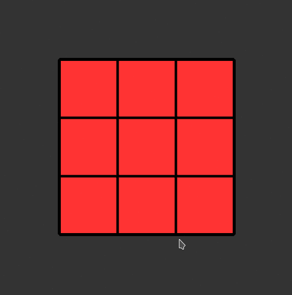

# README

## Rubik's Cube Simulator with Processing 

This simple simulator gives you all functionality of a Rubik's Cube, 
but without taking up the desk space!

Rotate the faces by clicking on them (or with the keyboard) and pan around in 3D with the mouse.

By making use of [Processing](https://processing.org/), its really simple to get up
and running in a simple 3D graphics environment. This sketch also makes use of [PeasyCam](https://github.com/jdf/peasycam) by Jonathan Feinberg.

### Controls
 + left-click turns a face clockwise
 + right-click turns it the counterclockwise
 + `r` for the right-hand-side face (blue)
 + `l` for the left-hand side face (green)
 + `f` for the front face (red)
 + `b` for the back face (orange)
 + `u` for the upward face (yellow)
 + `d` for the downward face (white)
 + use `shift` + `<key>` to turn counterclockwise 
